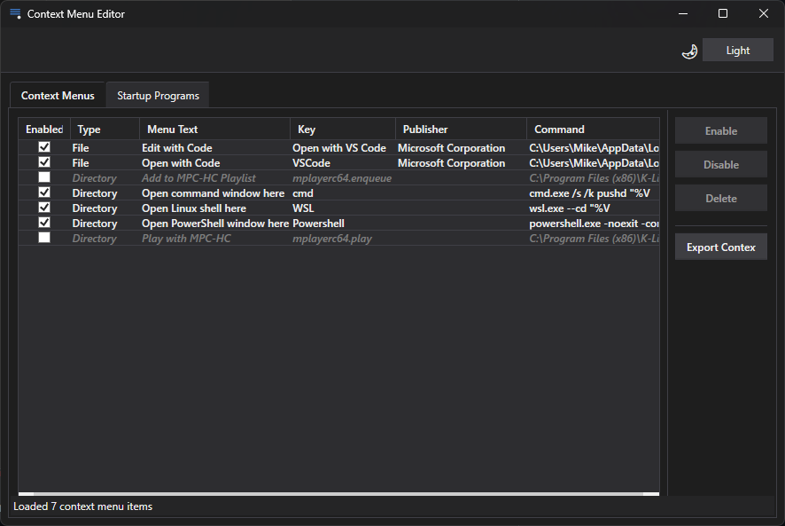
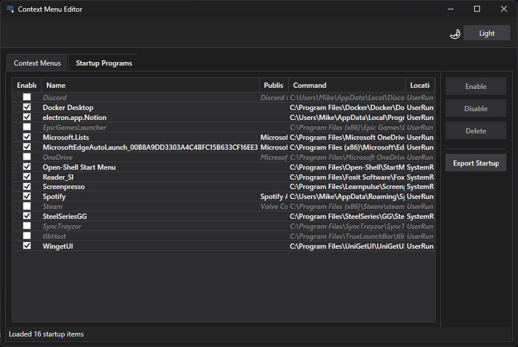

# Context Menu Editor

A Windows application for managing context menu items.

## Installation

1. Download the latest release ZIP file
2. Extract all files to a folder of your choice
3. Right-click `ContextMenuEditor.exe` and select "Run as administrator"

## Requirements

- **Operating System**: Windows 10/11 (build 17763 or later)
- **Privileges**: Administrator rights (required for registry access)
- **.NET Runtime**: Included in the package (self-contained deployment)

## Features

### Core Functionality
- **View Context Menus**: Displays all context menu items for files, directories, and drives
- **Enable/Disable**: Toggle context menu items on/off without deleting them
- **Delete**: Permanently remove unwanted context menu entries
- **Backup**: Export registry entries to .REG file for easy restoration
- **Smart Filtering**: Automatically filters out Windows system programs
- **Deduplication**: Shows one entry per program while managing all registry locations

### User Interface
- **Dark/Light Theme**: Toggle between themes with Windows title bar integration
- **Single Unified View**: All context menu types in one sortable grid
- **Visual Feedback**: Disabled items shown in gray italic text
- **Column Management**: Auto-sizing and flexible column widths

## Screenshots

### Context Menus Management

*View and manage all Windows context menu items in a unified interface*

### Startup Programs Management

*Control which programs run at Windows startup*

## Usage

### Enable/Disable Context Menu Items
1. Select an item from the list
2. Click the **Disable** button to hide it from context menus
3. Click **Enable** to restore it

### Delete Context Menu Items
1. Select one or more items
2. Click the **Delete** button
3. Confirm the deletion in the dialog

### Backup Registry Entries
1. Click **Backup Registry Entries**
2. Choose a location to save the .REG file
3. Double-click the .REG file to restore entries if needed

### Switch Themes
- Click the theme button (🌙 **Light**/**Dark**) in the top-right corner

## Important Notes

⚠️ **Administrator Privileges Required**: This application requires administrator rights to modify Windows registry entries. You will see a UAC (User Account Control) prompt when launching the app.

⚠️ **Registry Modifications**: This application modifies the Windows registry. Always create a backup before making changes.

⚠️ **System Stability**: The application filters out built-in Windows context menu items to prevent accidental system changes.

## Troubleshooting

### Application won't start
- Ensure you're running Windows 10 build 17763 or later
- Make sure you're running the application as administrator

### Changes don't appear in context menus
- Try logging off and back on
- Some applications may cache context menu entries

### "Access Denied" errors
- Ensure the application is running with administrator privileges
- Some registry keys may be protected by Windows

## Technical Details

- **Framework**: .NET 8 Windows WPF
- **Architecture**: MVVM (Model-View-ViewModel) pattern
- **Registry Access**: Uses Microsoft.Win32.Registry with proper error handling
- **Theme System**: Custom theme manager with Windows DWM integration
- **Resource Resolution**: P/Invoke for resolving DLL resource strings

## Copyright

Copyright © 2025 HomeChicken Software

## Support

For issues, questions, or feature requests, please visit the project repository on GitHub.

